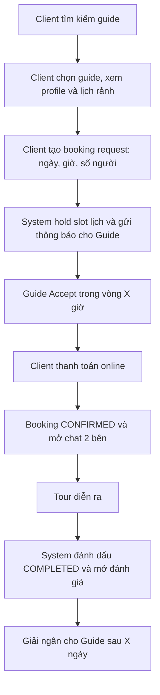

### Phân tích yêu cầu hệ thống đặt Hướng dẫn viên du lịch (Marketplace)

### 1. Tổng quan hệ thống

Đây là một **nền tảng marketplace** kết nối **khách du lịch (Client)** với **hướng dẫn viên địa phương (Guide)**, tương tự Airbnb Experiences hoặc GetYourGuide, nhưng tập trung vào **thuê guide cá nhân**.

**Mục tiêu cốt lõi**

- Client tìm kiếm và đặt Guide theo nhu cầu.
- Guide cung cấp dịch vụ, quản lý lịch rảnh, nhận booking, theo dõi doanh thu.
- Admin duyệt hồ sơ, kiểm soát vận hành, xử lý tài chính và cấu hình hệ thống.

---

### 2. Actor và vai trò

| Actor | Vai trò | Đặc điểm / hành vi chính |
| --- | --- | --- |
| Client (Khách du lịch) | Người mua dịch vụ | Tìm kiếm, đặt lịch, thanh toán, đánh giá |
| Guide (Hướng dẫn viên) | Người cung cấp dịch vụ | Đăng ký, tạo tour mẫu, cập nhật availability, nhận booking |
| Admin | Vận hành hệ thống | Duyệt hồ sơ, quản lý booking, quản lý tài chính, cấu hình |
| System | Tự động hóa | Gửi thông báo, xử lý thanh toán, nhắc lịch, cập nhật trạng thái |

---

### 3. Use case theo module

### 3.1. Module Client

**A. Xác thực và hồ sơ**

- UC01: Đăng ký tài khoản (email hoặc social login)
- UC02: Đăng nhập, đăng xuất
- UC03: Quản lý hồ sơ cá nhân (ảnh, thông tin, ngôn ngữ ưa thích)

**B. Tìm kiếm và khám phá**

- UC04: Tìm kiếm guide theo `địa điểm` + `ngày` + `ngôn ngữ` + `khoảng giá`
- UC05: Xem danh sách guide với filter hoặc sort (rating, giá, khoảng cách)
- UC06: Xem profile chi tiết guide (mô tả, tour mẫu, lịch rảnh, đánh giá)

**C. Đặt lịch và thanh toán**

- UC07: Tạo booking (chọn ngày giờ, số người, điểm tham quan mong muốn)
- UC08: Xem tóm tắt đơn hàng, tính tổng tiền (bao gồm phí dịch vụ)
- UC09: Thanh toán online (VNPay, Stripe, v.v.)
- UC10: Xem lịch sử booking và trạng thái `pending → confirmed → completed / cancelled`
- UC11: Hủy booking, yêu cầu hoàn tiền theo chính sách

**D. Tương tác**

- UC12: Chat hoặc nhắn tin với guide (sau khi booking confirmed)
- UC13: Đánh giá và nhận xét sau khi tour completed

---

### 3.2. Module Guide

**A. Onboarding**

- UC14: Đăng ký tài khoản guide (submit hồ sơ chờ duyệt)
- UC15: Upload giấy tờ xác minh (CMND/CCCD, chứng chỉ hướng dẫn viên, ảnh selfie)
- UC16: Cập nhật hồ sơ chuyên nghiệp (ngôn ngữ, khu vực, kinh nghiệm, ảnh)

**B. Quản lý dịch vụ**

- UC17: Tạo hoặc chỉnh sửa tour mẫu (tên, mô tả, thời lượng, giá, số người tối đa)
- UC18: Cập nhật lịch availability (theo ngày/tuần, block ngày nghỉ)
- UC19: Định giá linh hoạt (giá theo giờ, theo tour, theo số người)

**C. Quản lý booking**

- UC20: Nhận thông báo booking mới
- UC21: Accept hoặc Decline booking (kèm lý do nếu từ chối)
- UC22: Xem chi tiết chuyến đi sắp tới (thông tin khách, địa điểm, ghi chú)

**D. Tài chính và phản hồi**

- UC23: Xem doanh thu cá nhân (đã nhận, chờ giải ngân)
- UC24: Xem lịch sử tour đã dẫn
- UC25: Phản hồi đánh giá từ khách

---

### 3.3. Module Admin

**A. Quản lý người dùng**

- UC26: Xem, tìm kiếm, khóa hoặc mở tài khoản client và guide
- UC27: Phân quyền (admin, staff, guide, client)

**B. Duyệt hồ sơ guide**

- UC28: Xem danh sách guide chờ duyệt
- UC29: Approve hoặc Reject hồ sơ (kèm ghi chú phản hồi)
- UC30: Yêu cầu bổ sung giấy tờ

**C. Quản lý vận hành**

- UC31: Xem và quản lý tất cả booking trên hệ thống
- UC32: Xử lý khiếu nại từ client hoặc guide
- UC33: Hoàn tiền thủ công (manual refund)

**D. Quản lý nội dung**

- UC34: Quản lý bài viết blog, địa điểm nổi bật
- UC35: Quản lý trang tĩnh (About, FAQ, Terms)

**E. Tài chính và báo cáo**

- UC36: Quản lý hoa hồng (commission rate theo guide hoặc loại tour)
- UC37: Quản lý giải ngân (payout management)
- UC38: Báo cáo doanh thu tổng hợp (theo ngày/tháng/quý)
- UC39: Thống kê hành vi người dùng, tỉ lệ chuyển đổi

**F. Cấu hình hệ thống**

- UC40: Cài đặt phí dịch vụ, chính sách hủy, chính sách hoàn tiền
- UC41: Quản lý email template và push notification
- UC42: Cấu hình đa ngôn ngữ (i18n)

---

### 4. Luồng nghiệp vụ chính

### 4.1. Luồng đặt tour (Happy Path)

### 4.2. Luồng từ chối hoặc hủy

- **Guide Decline**
    - System hủy hold lịch
    - Thông báo Client
    - Gợi ý guide khác
- **Client Cancel**
    - Áp dụng chính sách hủy
    - Hoàn tiền nếu đủ điều kiện

---

### 5. Yêu cầu phi chức năng (NFR)

### Hiệu năng

- Tìm kiếm guide trả kết quả trong **< 2 giây** với quy mô hàng nghìn guide.
- Availability đồng bộ **real-time** để tránh double booking.

### Bảo mật

- Không lưu thông tin thanh toán nhạy cảm trực tiếp. Tích hợp payment gateway đạt chuẩn **PCI-DSS**.
- Giấy tờ tùy thân của guide cần **mã hóa** và **kiểm soát truy cập** chặt.

### Khả năng mở rộng

- Hỗ trợ **đa ngôn ngữ (i18n)** ngay từ đầu.
- Thiết kế module tách bạch để dễ thêm tính năng (group tour, subscription).

### Độ tin cậy

- Booking state xử lý bằng cơ chế transaction để tránh sai lệch dữ liệu.
- Chat hỗ trợ real-time (SignalR hoặc WebSocket).